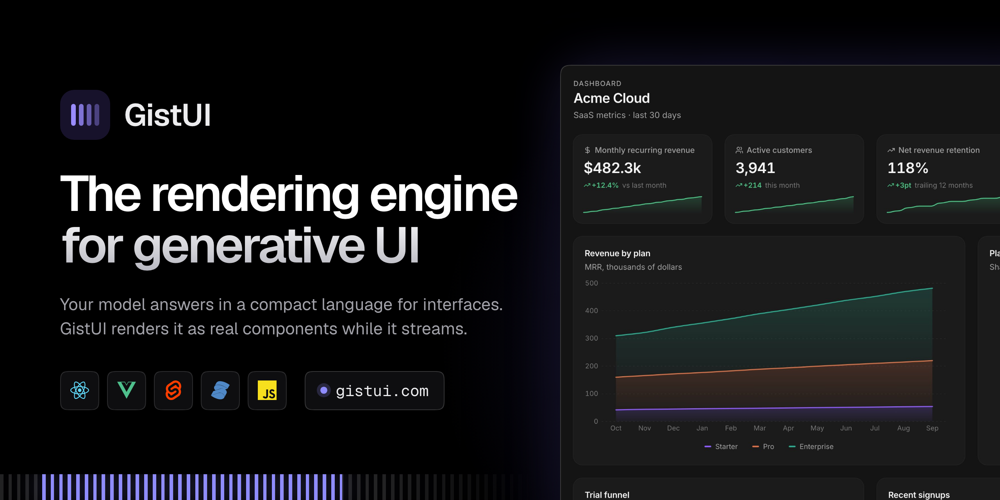

<div align="center">

<a href="https://gistui.com">
  
</a>

<h1>GistUI</h1>

<p><b>The rendering engine for generative UI.</b></p>

<p>
A model answers in <b>GistUI Lang</b>, a compact language for interfaces, and your app renders it as real,<br />
interactive UI (dashboards, forms, reports, slide decks, galleries) while it streams.
</p>

<p>
  <a href="https://gistui.com"></a>
  <a href="#quick-start"></a>
  <a href="benchmark.md"></a>
</p>

<p>
  <a href="LICENSE"></a>
  <a href="CHANGELOG.md"></a>
  <a href="https://github.com/GistUI/GistUI/stargazers"></a>
  
  
  <a href="https://github.com/GistUI/GistUI/issues"></a>
</p>

<p>
  <a href="#quick-start">Quick start</a> ·
  <a href="#packages">Packages</a> ·
  <a href="#benchmarks">Benchmarks</a> ·
  <a href="spec">Format spec</a> ·
  <a href="CHANGELOG.md">Changelog</a>
</p>

</div>

<br />

## What it looks like

The model writes a few lines of GistUI Lang:

```gistui
root = Page(Header("Q3 revenue", "All regions"), kpis, Card(Chart(rev, type:line, y:"USD")))
kpis = Stats(kpiData)
kpiData = |Label|Value|Delta
|Revenue|$1.2M|+8%
|Customers|3,410|-2.1%
rev = |Month|Revenue
|Jul|380000
|Aug|402000
```

Your app shows a page with a header, two KPI cards and a line chart, filling in as the text arrives.

## Why GistUI

| | |
|---|---|
| **Any framework** | React, Vue, Svelte, Solid or vanilla JavaScript, with the same 63 components, look and behaviour in each. |
| **Your own components** | Replace any built-in one with your shadcn/ui, MUI or design-system component. Forms, validation, actions and dialogs keep working. |
| **Repairs mistakes in code** | When a model's answer ends with mistakes, the renderer fixes them, with no model call, and shows the fixed version in place. |
| **Fast and small** | The parser handles each statement once while streaming. The runtime is 32 KB and the default components are 74 KB on first load (gzip); heavier components load on demand. |
| **Safe by default** | A program is treated as untrusted: it cannot run code, tools that change something run only when a person presses a button, and images load only from hosts you allow. |

## Quick start

**1. Install** the package for your framework and the stylesheet.

```sh
npm install @gistui/react @gistui/styles   # or @gistui/vue, @gistui/svelte, @gistui/solid, @gistui/vanilla
```

**2. Give your model the system prompt**, where you call it.

```ts
import { prompt } from "@gistui/catalog";

const system = prompt().text;
```

**3. Render the answer** in your app.

```tsx
import "@gistui/styles/styles.css";
import { GistUI } from "@gistui/react";
import { ui } from "@gistui/react/ui";

<GistUI library={ui} stream={response.body} onAction={(a) => console.log(a)} />;
```

Each package's README has the same three steps for its framework.

### With a coding agent

The repository has an agent skill, [`skills/gistui`](skills/gistui), and `@gistui/catalog` ships it.
After an install, tell your agent (Claude Code, Codex, Cursor…):

```text
Read node_modules/@gistui/catalog/skills/gistui/SKILL.md and add GistUI to this app.
```

`SKILL.md` has the steps for every framework, the Vercel AI SDK, tools, forms and theming;
`reference.md` next to it is the language itself, generated from the catalog.

### With the Vercel AI SDK

`streamText` works as it is: pass GistUI's prompt as `system`, and return `toTextStreamResponse()`
for `<GistUI stream>` or `toUIMessageStreamResponse()` for `useChat` and `@gistui/chat`'s `aiSdk()` adapter.

```ts
import { prompt } from "@gistui/catalog";
import { convertToModelMessages, streamText } from "ai";

const result = streamText({ model, system: prompt().text, messages: await convertToModelMessages(messages) });
return result.toTextStreamResponse();
```

## Packages

| Package | What it is |
|---|---|
| [`@gistui/react`](packages/react) | React renderer and default components |
| [`@gistui/vue`](packages/vue) | Vue 3.5+ and Nuxt |
| [`@gistui/svelte`](packages/svelte) | Svelte 5 and SvelteKit |
| [`@gistui/solid`](packages/solid) | Solid and SolidStart |
| [`@gistui/vanilla`](packages/vanilla) | Vanilla JavaScript renderer, no framework (the base of Vue, Svelte and Solid) |
| [`@gistui/catalog`](packages/catalog) | The default components' schemas and the system prompt |
| [`@gistui/styles`](packages/styles) | One stylesheet for every framework |
| [`@gistui/server`](packages/server) | Stream reading, validation and repair on the server |
| [`@gistui/chat`](packages/chat) | Headless chat store, model adapters, React chat layouts |
| [`@gistui/core`](packages/core) | The language: streaming parser, validator, autofix, prompt generator |
| [`@gistui/headless`](packages/headless), [`@gistui/widgets`](packages/widgets) | Shared internals: engine, themes, charts, Markdown |

Examples are in [`examples/`](examples) (Vue, Svelte, Solid, React with shadcn/ui), and the playground is in [`apps/playground`](apps/playground).

## Benchmarks

Measured with OpenUI's own benchmark (46 screens × 4 runs), against OpenUI, A2UI and json-render. The full tables and how to reproduce them are in [`benchmark.md`](benchmark.md).

| Model | GistUI, as written | GistUI, after autofix | OpenUI | Output tokens, GistUI vs OpenUI |
|---|---:|---:|---:|---:|
| gpt-oss-120b (current prompt) | 87.0% valid | **100%** | 84.2% | 526 vs 597 (−12%) |
| Gemini 3.7 Flash (earlier prompt) | 87.5% valid | **100%** | 98.9% | 1,443 vs 1,637 (−12%) |

- **System prompt:** 3,838 tokens, against 5,017 for OpenUI.
- **Cost** of a 46-screen pass on Gemini 3.7 Flash: $0.36, against $0.46 for OpenUI.
- **Streaming parse:** 130–150× faster than OpenUI's parser on the same screens.

## Develop

```sh
bun install
bun run build && bun run typecheck && bun run test
bun run test:visual    # screenshots of every example
bun run test:parity    # React, vanilla, Vue, Svelte and Solid render the same pixels
bun run test:shadcn    # shadcn/ui components behave like the built-in ones
bun run size           # bundle size gates
```

## Contributions

Pull requests are disabled. Coding agents make it too easy to send a large, low-context change that costs
maintainers more time than it saves. Thoughtful contributions are welcome; please understand the code, keep the
patch focused, and respect the review time you are asking for.

[Issues](https://github.com/GistUI/GistUI/issues) are open: report a bug, ask a question or propose a change there.
If a change is worth making, we will work out together how it gets in.

## Licence

[MIT](LICENSE)
